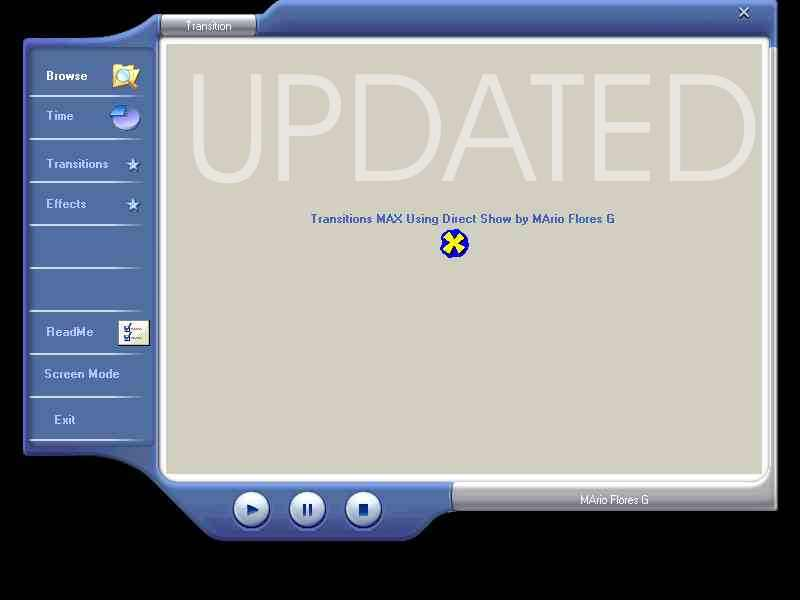



## TRANSITIONS MAX\!\!\!\!\! Coolest Transitions Ever \!\!\!\!\!\! RELOADED \(UPDATED\)

### Description

See Power Point Transitions(Look-Like)

MOVIE MAKER EFFECTS,Water Effetcs, Curls, Pixelate,Liquid, Stretch, Twister,A lot More,All ready Installed on your Computer!

Direct X Needed..Please READ...The README FILE!!! to explain...

You can pause the animation(Transition) in the moment that you like and restore it ,great for Lerning a little bit of Direct Show and more.... I RELOADIT and added some instructions because some coders don't understand the logic on this code..IF YOU LIKE THIS OR NOT PLEASE TELL ME WHY?

i upload this for fun and to get some help..READ THE README FILE FOR MORE....ENJOY!!!
 
### More Info
 

             |
---                |---
**Submitted On**   |2003-03-03 13:05:08
**By**             |[MArio Flores G](https://github.com/Planet-Source-Code/PSCIndex/blob/master/ByAuthor/mario-flores-g.md)
**Level**          |Advanced
**User Rating**    |4.6 (60 globes from 13 users)
**Compatibility**  |VB 4\.0 \(16\-bit\), VB 5\.0, VB 6\.0
**Category**       |[Custom Controls/ Forms/  Menus](https://github.com/Planet-Source-Code/PSCIndex/blob/master/ByCategory/custom-controls-forms-menus__1-4.md)
**World**          |[Visual Basic](https://github.com/Planet-Source-Code/PSCIndex/blob/master/ByWorld/visual-basic.md)
**Archive File**   |[TRANSITION155381332003\.zip](https://github.com/Planet-Source-Code/mario-flores-g-transitions-max-coolest-transitions-ever-reloaded-updated__1-43640/archive/master.zip)

